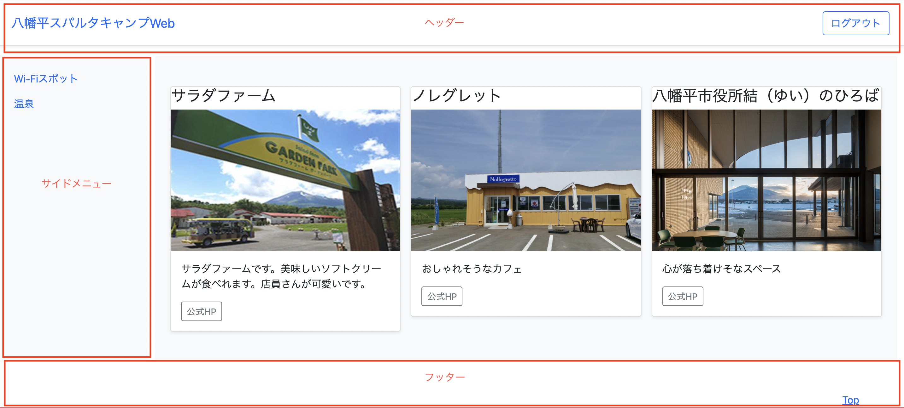

# 画面の共通項目について

## ヘッダ・サイドメニュー・フッターの共通化
* ログイン後は、各画面で共通のヘッダ・サイドメニュー・フッターを表示します



* 各画面では、共通化したファイルを読み込んでください

## 共通化したファイルの読み込み方法
* 共通化にはLaravelの＠yieldと@sectionという仕組みを使用します
* 共通化したファイルは、resources/views/layout/配下に格納しています
* 各画面では、@extends、@section、@includeを記載して、共通化したファイルを読み込みます
* 実質、各画面では「@section('content')〜@endsectionの間」(各画面固有のコンテンツ)を開発することとなります
* 例) Top画面(http://localhost/top)
```
@extends('layout.common')
@section('title', 'Top')

@include('layout.header')

@section('content')
    <div class="border-bottom">
        <h1 class="h2">Welcome to 八幡平スパルタキャンプ!!</h1>
    </div>
@endsection

@include('layout.sidebar')

@include('layout.footer')
```